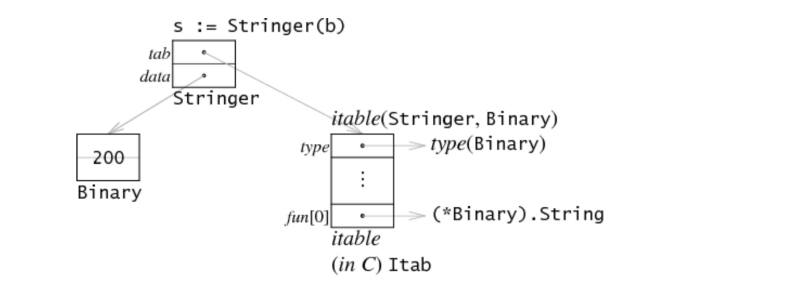
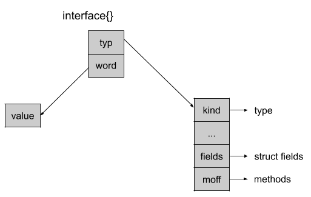

# Welcome

We will try to understand interface a bit more, then We will talk about reflection.

- What is it?
- How does it work?
- Where can we use it?
- What should we pay attention to when using?

---

# What is it?

An interface is two things: it is a set of methods, but it is also a type.

The `interface{}` type is the interface that has no methods. Since there is no implements keyword, all types implement at least zero methods, and satisfying an interface is done automatically, all types satisfy the empty interface

## set of methods

```go

type Animal interface {
    Speak() string
}

type Dog struct {
}

func (d Dog) Speak() string {
    return "Woof!"
}

func main() {
    animal := Dog{}
  
    fmt.Println(animal.Speak())
}

```

---
## type

```go

func DoSomething(v interface{}) {
   // ...
}
```
---

# How does it work?

```go
type iface struct {
    tab  *itab
    data unsafe.Pointer
}

type eface struct {
    _type *_type
    data  unsafe.Pointer
}
```



* Go unsafe pointers are much like C pointers.
* `tab` holds the address of an `itab` object, which embeds the datastructures that describe both the type of the interface as well as the type of the data it points to.
* `data` is a raw (i.e. `unsafe`) pointer to the value held by the interface.

```go
// rtype must be kept in sync with ../runtime/type.go:/^type._type.
type rtype struct {
    size       uintptr
    ptrdata    uintptr // number of bytes in the type that can contain pointers
    hash       uint32  // hash of type; avoids computation in hash tables
    tflag      tflag   // extra type information flags
    align      uint8   // alignment of variable with this type
    fieldAlign uint8   // alignment of struct field with this type
    kind       uint8   // enumeration for C
    equal     func(unsafe.Pointer, unsafe.Pointer) bool
    gcdata    *byte   // garbage collection data
    str       nameOff // string form
    ptrToThis typeOff // type for pointer to this type, may be zero
}

// emptyInterface is the header for an interface{} value.
type emptyInterface struct {
	typ  *rtype
    word unsafe.Pointer
}

```
---

- reflect package important functions

```go

func TypeOf(i interface{}) Type {
    eface := *(*emptyInterface)(unsafe.Pointer(&i))
    return toType(eface.typ)
}

func ValueOf(i interface{}) Value {
    if i == nil {
        return Value{}
    }
    escapes(i)
    
    return unpackEface(i)
}
```
---
# Benefits

- we can do whatever we want.
- You don't need to write repeated codes for each types

---

# Drawbacks
- High computation
- Bug, Panic possibility
- Difficult to implement and Test

---
# Generics vs Reflection

- Reflection provides more functionality.
- Generics High level Reflection Low level solution

---
# References

- https://github.com/teh-cmc/go-internals/blob/master/chapter2_interfaces/README.md#anatomy-of-an-interface
- https://www.henrydu.com/2021/02/07/golang-interface-brief-look/
- https://developpaper.com/research-on-the-interface-of-golang/
- https://cmc.gitbook.io/go-internals/chapter-ii-interfaces
- https://medium.com/a-journey-with-go/go-understand-the-empty-interface-2d9fc1e5ec72
- https://research.swtch.com/interfaces
- https://go101.org/article/unsafe.html
- https://github.com/golang/go/blob/master/src/runtime/runtime2.go

## slide tool

- https://github.com/maaslalani/slides

---

# Thank you 
- Questions ?
